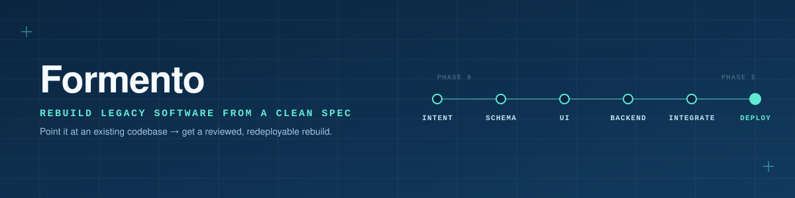

# Formento

**Working name:** Formento
**Status:** Milestone 1 shipped — the first real derived-mode project (NASC Practical Claim Portal) has been through the full pipeline: Phase 0 extraction through Phase 4 integration, plus a mid-project spec revision cascade. Packaged as an installable Claude Code plugin as of 2026-08-24.
**Author:** Thiru (Janakiraman Veerappan)

Formento is an agentic provisioning system that takes minimal input — a template pick, a conversation, or an existing project to reverse-engineer — and produces a fully running, deployable form-heavy application, built through a series of user-gated checkpoints rather than a single autonomous generation pass.

## Contents

- [`docs/spec.md`](docs/spec.md) — original vision/rationale spec (problem statement, entry modes, phased pipeline, architecture sketch, MVP scope)
- [`docs/PRD.md`](docs/PRD.md) — **the buildable requirements**: goals, non-goals, user stories, P0/P1/P2 requirements with acceptance criteria, success metrics, open questions
- [`docs/spec-ir-schema.md`](docs/spec-ir-schema.md) — concrete Spec IR data contract (TypeScript types) that Claude Code builds against
- [`docs/build-plan.md`](docs/build-plan.md) — milestone-by-milestone build order (M0 Spec IR core → **M1 derived-mode extraction → fresh-rebuild, the first real project** → M2 conversational/templated entry → M3 Phase 2/3 → M4 Phase 4/5 deployed v1 → M5 migration fork, deferred)
- [`docs/decisions/`](docs/decisions) — architecture/decision records as they're made
- [`docs/open-questions.md`](docs/open-questions.md) — tracked open questions pulled from the spec, for ongoing resolution (see also PRD.md's Open Questions for build-blocking ones)
- [`docs/tooling-setup.md`](docs/tooling-setup.md) — the `.claude/` subagents, commands, hooks, and MCP servers set up for building this in Claude Code
- [`docs/milestone-1-source.md`](docs/milestone-1-source.md) — the confirmed Milestone 1 source project (Practical_Database: raw SQL + procedural PHP), its schema, and known gaps to watch for

## Using this as a Claude Code plugin

As of 2026-08-26 ([docs/decisions/0011](docs/decisions/0011-claude-code-plugin-packaging.md)), this repo is itself an installable Claude Code plugin — `agents/`, `commands/`, `skills/`, `hooks/hooks.json`, and `.mcp.json` at repo root (alongside `.claude-plugin/plugin.json`) are the pipeline's actual payload, not just documentation about it. Install it locally to try it:

```bash
claude --plugin-dir /path/to/formento
```

Or install it from its own self-hosted marketplace ([`.claude-plugin/marketplace.json`](.claude-plugin/marketplace.json)) without cloning:

```bash
/plugin marketplace add menporulalar/formento
/plugin install formento@formento-marketplace
```

Then run `/phase0-intent` (or ask in plain language — "start a new Formento project") to begin. `commands/` gives each phase a literal slash command — the intended way to drive Formento, since phase progression is meant to be deliberate and user-triggered, never auto-started by Claude. `skills/` mirrors the same 8 triggers as a secondary natural-language discovery path. `agents/` holds the 15 phase/reviewer agents they dispatch, and `hooks/hooks.json` carries the format-on-write, Spec IR structural-check, and destructive-command-guard hooks.

## Repo layout (docs/decisions/0006, updated by 0010 and 0011)

This repo holds the spec, PRD, build plan, decisions, the plugin payload (`agents/`, `commands/`, `skills/`, `hooks/`), **and** the pipeline implementation:

- **[`agents/`](agents/), [`commands/`](commands/), [`skills/`](skills/), [`hooks/`](hooks/), `.mcp.json`, `.claude-plugin/plugin.json`** — the installable plugin itself ([docs/decisions/0011](docs/decisions/0011-claude-code-plugin-packaging.md)). Previously lived as project-level `.claude/agents/`, `.claude/commands/`, and `.claude/settings.json`; `.claude/` no longer carries these — see the decision doc for why and how the two differ.
- **[`engine/`](engine/)** — the TypeScript implementation: Spec IR types/validators, checkpoint state machine, phase compiler logic. Previously a separate `formento-engine` repo; merged in here 2026-08-24 (docs/decisions/0010) once it became clear the split wasn't earning its keep — `engine/` was still pure scaffold and every real phase execution ran through the agent layer directly, never through compiled engine code. Milestone 0 onward lands under `engine/`, with its own CI (`.github/workflows/engine-ci.yml`).
- **Generated projects** — each real app Formento builds (starting with the Milestone 1 derived-mode project) lives in its own separate folder/repo, never inside this one.

## Quick summary

Three entry modes (conversational, templated, derived-from-existing-project) all normalize into one canonical Spec IR. A checkpoint-gated 6-phase pipeline (Intent Capture → Schema & Workflow → UI/UX Scaffold → Backend & Data → Integration → Deploy) compiles that spec into a real, deployed application — never a single autonomous generation pass.

Suggested default stack: Next.js + React (pluggable UI framework adapter, starting with shadcn/ui + Tailwind for v1), PostgreSQL + Prisma, Redis + BullMQ, MinIO, Docker/VPS.

See `docs/spec.md` for the full spec and `docs/open-questions.md` for resolved v1 decisions (checkpoint UI, target user, extraction-only scope, UI adapter shortlist, naming).
